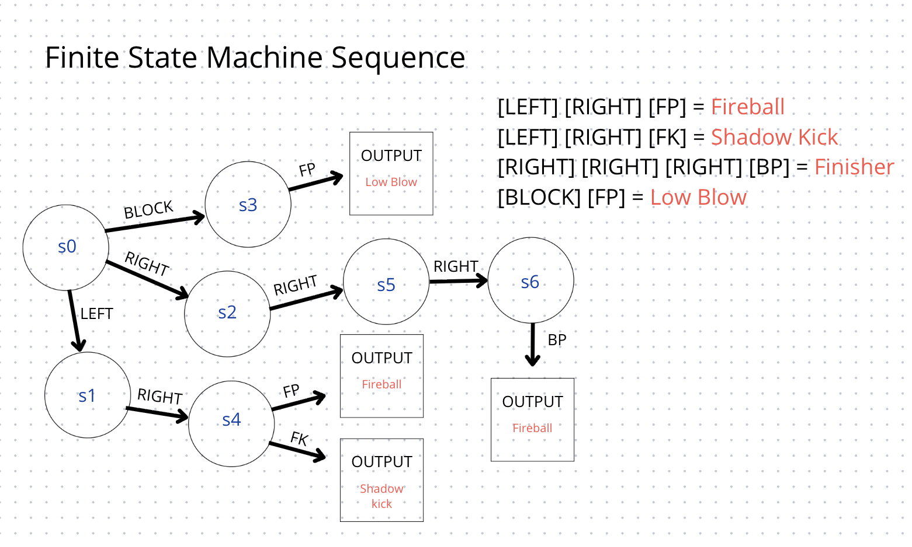

# Finite State Machine

## FSM
  - **Σ**(input alphabet, defined in .grm file) - {up, down, left, right, q}
  - **S**(states, a set of fighting commands) - {fireball, shadow kick, idle}
  - **s0**(initial state) - idle
  - **δ**(state-transition function: δ : S x Σ → S) - idle x q = fireball
  - **F**(final states) - {fireball, shadow kick}

## State transition function generation
### 1. A grammar file
```
[LEFT] [RIGHT] [FP]             = Fireball (Johnny Cage)
[LEFT] [RIGHT] [FK]             = Shadow Kick (Johnny Cage)
[BLOCK] [FP]                    = Low Blow (Johnny Cage)
[RIGHT] [RIGHT] [RIGHT] [BP]    = Finisher (Johnny Cage)
```

### 2. Generation



## Notes
1. A language is a `regular language` if a `finite state machine` recognizes it. The `F.S.M` memory is very limited. It cannot store the string, cannot count, cannot look at the earlier part of the string. It does not know what has happened before, it only knows what state it is at. If a language requires memory - it is not regular.
2. `Determenistic` vs `Nondetermenistic` state machines.
    - `Determenistic`: Only 1 unique next state. No choices.
    - `Nondetermenistic`: May be multiple next states. Which one to choose?
3. `Tail-recursive` functions: where the recursive call is the very last action done before the function returns. That means after calling itself, it does no extra work. Many languages can optimize tail-recursive calls to reuse the current function's memory stack(effectively turning recursion into iteration under the hood). This lets the recursion run without growing the call stack, preventing `stack overflow` and making the recursion as efficient as loops.
    - `Tail-recursive`:
      ```python
      def factorial(n, acc=1):
        if n == 0:
          return acc
        else:
          return factorial(n-1, n*acc) 
      ```
    - `Non tail-recursive`
      ```python
      def factorial(n):
        if n == 0:
          return 1
        else:
          return n * factorial(n-1) 
      ```

## Materials
- Theory of Computation; Portland State University: https://www.youtube.com/watch?v=LuGs7WhlHWA&list=PLbtzT1TYeoMjNOGEiaRmm_vMIwUAidnQz&index=2
- Stanford CS123: https://web.stanford.edu/class/cs123/lectures/CS123_lec07_Finite_State_Machine.pdf
- Newcastle University: https://research.ncl.ac.uk/game/mastersdegree/gametechnologies/previousinformation/artificialintelligence1finitestatemachines/2016%20Tutorial%208%20-%20Finite%20State%20Machines.pdf
- More Newcastle University: https://research.ncl.ac.uk/game/mastersdegree/gametechnologies/aitutorials/1state-basedai/AI%20-%20State%20Machines.pdf
- 42 ecole
